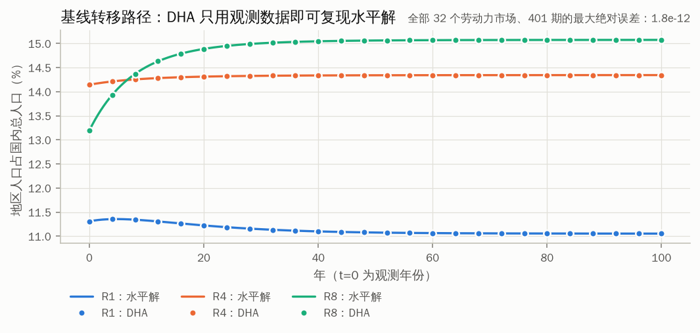
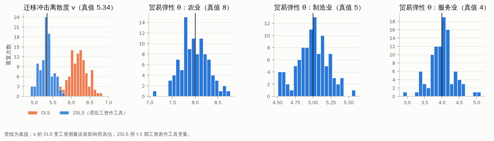
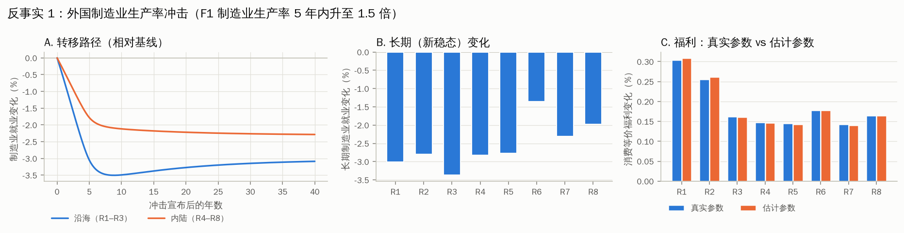
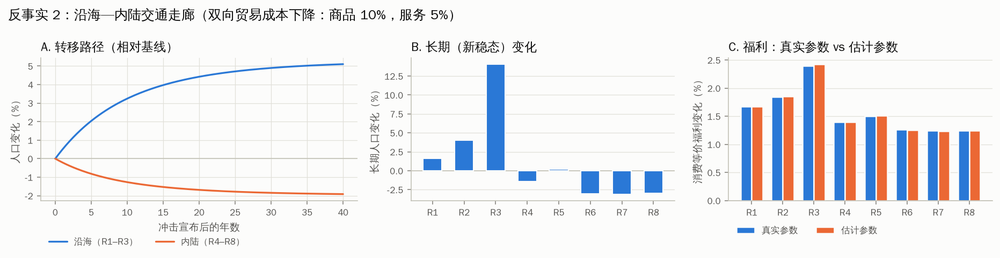
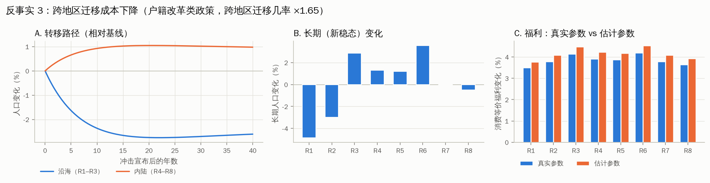

# CDP 型动态空间一般均衡模型：模拟数据基准

从零实现一个 Caliendo, Dvorkin & Parro (2019, *Econometrica*) 类型的**动态空间一般均衡模型**，用模拟数据跑通"求解 → 估计 → 反事实"的完整流程，并用已知基本面的水平解逐项验证。后续接入真实数据时，只需替换数据输入，求解、估计、反事实的代码都不用改。

模型要素：
- 前瞻性劳动者在"地区 × 部门（含非就业）"劳动力市场之间迁移，有迁移摩擦，偏好冲击为第一类极值分布；
- 多部门 Eaton–Kortum 贸易，带投入产出联系；
- 结构（土地/建筑）作为固定要素，租金进入全球组合，由此产生贸易不平衡；
- 国内地区之间可以迁移，外国劳动力固定。

## 这个基准做了什么

1. **数据生成过程**：8 个国内地区（3 个沿海、5 个内陆）+ 2 个外国，3 个部门，32 个劳动力市场，季度频率（β = 0.99，ν = 5.34，θ = (8, 5, 4)）。历史期受生产率冲击和运费冲击；在完全预见下求出水平解，作为"真实经济"。
2. **可观测数据**：观测期截面 $(L, \mu_{-1}, \pi, X, wL)$；带多项分布抽样误差的季度迁移面板；带测量误差的实际工资；年度双边贸易额与运费。
3. **估计**：
   - 贸易弹性 θ：PPML 面板引力方程，含进口地×年、出口地×年、地区对三组固定效应；
   - 迁移弹性 ν：Artuç–Chaudhuri–McLaren / CDP 欧拉型方程，固定 β，用滞后工资作工具变量做 2SLS；
   - 以上做 100 次蒙特卡洛。
4. **动态帽子代数（DHA）**：只用观测数据和弹性，求解基线和三个反事实，并与已知基本面的水平解逐一对照：
   - 反事实 1：外国制造业生产率冲击（类似"中国冲击"）；
   - 反事实 2：沿海—内陆交通走廊，降低双向贸易成本；
   - 反事实 3：跨地区迁移成本下降（户籍改革类政策）。

## 快速开始

```bash
cd cdp_dynamic_qse
pip install -r requirements.txt
python -m pytest -q              # 8 项正确性测试（约 5 秒）
python run_pipeline.py --quick   # 快速版（约 1–2 分钟）
python run_pipeline.py           # 完整版：T = 400 季度、蒙特卡洛 100 次（约 4–5 分钟）
```

输出写入 `output/`：`results.md`（自动生成的结果摘要）、`tables/*.csv`、`figures/*.png`。

## 目录结构

```
cdp_dynamic_qse/
├── cdp/
│   ├── model.py        参数（Params）、基本面（Fundamentals）、劳动力市场索引
│   ├── static_eq.py    临时均衡：水平解 与 精确帽子代数（共用一个求解内核，沿时间维度批量并行）
│   ├── dynamics.py     水平解的序贯均衡、DHA 基线、DHA 反事实、福利与分解
│   ├── estimation.py   PPML（多组固定效应、聚类稳健）、组内 2SLS、θ 与 ν 的估计
│   ├── simulate.py     模拟经济、历史冲击、可观测数据与抽样误差
│   ├── accel.py        Anderson 加速
│   └── plotting.py     作图
├── docs/model.md       模型、DHA、反事实、估计方程的完整推导，以及数值算法
├── tests/test_model.py 正确性测试
├── run_pipeline.py     一键运行完整流程
└── output/             结果（图、表、摘要）
```

## 主要结果（完整版）

### 1. DHA 与水平解完全一致

DHA 只用观测数据和弹性，不知道任何基本面水平值（生产率、贸易成本、迁移成本、结构存量、家庭生产）。它与知道全部基本面的水平解之间的最大绝对误差如下：

| | 劳动力 L | 实际工资 log ω | 终生价值 D₀ |
|---|---|---|---|
| 基线（401 期） | 1.8e-12 | 1.1e-11 | — |
| 反事实 1–3 | ≤ 2.0e-12 | ≤ 3.8e-12 | ≤ 3.5e-11 |



### 2. 弹性估计能恢复真值（100 次蒙特卡洛）

| 参数 | 真值 | 均值 | 标准差 | 偏误 |
|---|---|---|---|---|
| ν（OLS） | 5.34 | 6.20 | 0.23 | +16.1% |
| ν（2SLS） | 5.34 | 5.32 | 0.18 | −0.3% |
| θ 农业 / 制造业 / 服务业 | 8 / 5 / 4 | 7.98 / 4.99 / 4.00 | 0.31 / 0.22 / 0.35 | ≤ 0.2% |

- 工资测量误差使 OLS 高估 ν；2SLS 用 t−1 期工资差作工具变量，可以纠正这一偏误。
- 贸易弹性最初只用截面估计时严重有偏：不可观测的地区对贸易成本主导了误差。改用面板加地区对固定效应后，偏误消失。详见 `docs/model.md` §7.2。



### 3. 反事实

| 情景 | 40 年后（相对基线） | 全国福利（消费等价）<br>真实参数 / 估计参数 |
|---|---|---|
| 外国制造业生产率冲击 | 制造业就业：沿海 −3.1%，内陆 −2.3% | +0.18% / +0.18% |
| 沿海—内陆交通走廊 | 人口：沿海 +5.1%，内陆 −1.9% | +1.50% / +1.51% |
| 跨地区迁移成本下降 | 人口：沿海 −2.6%，内陆 +1.0% | +3.84% / +4.14% |

- 外国冲击使制造业就业下降，其中对外国敞口最大的沿海地区降幅最大。但进口品变便宜，各地区福利都略有上升，这与 CDP 的结论方向一致。
- 前两个反事实对估计误差不敏感。迁移成本情景的福利大致与 ν 成正比：这里的"估计参数"来自一份数据，其 ν̂ = 5.75，恰好比蒙特卡洛均值高 2.4 个标准差，福利因此被高估约 8%。这说明对迁移类政策而言，ν 的精度很重要。





完整的地区层面结果见 `output/results.md`。

## 接入真实数据需要替换什么

DHA 的输入全部集中在 `observed_cross_section()` 返回的 `obs` 和 `Params` 中：

| 模型对象 | 含义 | 中国数据的可能来源 |
|---|---|---|
| `L0`（M 维） | 初期各"地区 × 部门/非就业"的人口 | 人口普查、1% 抽样调查、经济普查 |
| `mu_prev`（M×M） | 上一期的迁移流矩阵（地区 × 部门转换） | 普查中的"五年前常住地"、CMDS、CLDS 等微观数据 |
| `pi0`（N×N×J） | 双边贸易份额 | 中国多区域投入产出表（如 CEADs）；国际部分用 WIOD 或 OECD ICIO |
| `wL0`、`X0` | 各地区部门的劳动收入、总支出 | 区域投入产出表、统计年鉴 |
| `alpha, gamma_va, gamma_io, xi` | 消费结构、增加值率、投入产出系数、结构份额 | 区域投入产出表、资金流量表 |
| `iota` | 资产组合份额（刻画贸易不平衡） | 由数据反推：`static_eq.calibrate_iota` |
| `theta` | 贸易弹性 | `estimate_trade_elasticity`（需要随时间变化的贸易成本指标），或文献值 |
| `nu, beta` | 迁移弹性、折现因子 | `estimate_migration_elasticity`（需要迁移流与实际工资面板），或文献值 |

**用真实数据时要注意：**
- **频率**：模型的一期必须与迁移数据的时间窗口一致。普查是 5 年窗口，β 和 ν 要相应换算。
- **数据一致性**：π、X、wL 必须满足市场出清 (3.3)–(3.4)。CDP 的做法是先用模型方程调整数据，使其一致。
- **零流量**：`mu_prev` 中的零在 DHA 中会一直保持为零。可以合并单元，或用平滑后的流量。
- **截面测量误差**：本基准假设观测期截面没有误差，真实数据中需要做稳健性分析。

## 已知局限与可扩展方向

- 完全预见，冲击在 t=0 一次性宣布；基线假设基本面此后不变。CDP 的框架允许基线基本面随时间变化，只要把 Θ̇ 输入临时均衡即可。
- 没有资本积累。可以扩展为 Kleinman, Liu & Redding (2023, *Econometrica*) 的资本 + 迁移模型。
- 外国劳动力固定，国际间不迁移。
- PPML 三向固定效应的聚类标准误偏小（Weidner & Zylkin 2021）。真实数据中建议用自助法。
- 只有一个模拟经济（seed = 7），可以用 `--seed` 换一个经济重跑。
